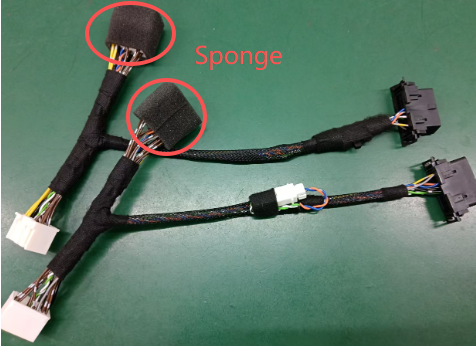

# Purpose 
We are working to take to market a fully open-source design for an Ioniq 5 preconditioning button and similar features (e.g. remote climate) that can be implemented with a hardware retrofit. This repository serves to document progresss on Ioniq 5 CAN reverse-engineering and progress towards a sellable kit.
Major contributors to date:
- [dragz](https://github.com/dragz): CAN reverse-engineering
- [liz](https://github.com/L1Z3): firmware, CAN reverse-engineering
- [tylerharvey](https://github.com/tylerharvey): glue guy/productizing
- [Tichael](https://github.com/Tichael): technical review
- [Thomas](https://www.ioniqforum.com/members/thomas212.6422/): CAN reverse-engineering

# Structure
This project has a few moving parts:
- CAN messages (talking to the car)
- microcontroller to inject CAN messsages (box that talks to the car)
- firmware for that microcontroller (programming for the box)
- wiring harnesss to adapt microcontroller to car (how to plug the box into the car)
- user interface (the button that triggers preconditioning)

We have alpha (DIY) prototype versions or better of all of the above on several platforms.

# Current Status
1. CAN messages:
   - The necessary CAN messages to initiate preconditioning on 2021-2024 E-GMP cars were isolated by dragz and I in early March 2026. 
2. microcontroller: 
   - We have a line on a cheap prepackaged microcontroller. If you follow the breadcrumbs, it's fairly easy to work out what we plan to use. But since there are a limited quantity remaining, I'll avoid clearly stating what it is.
3. firmware:
   - So far, Liz and I have worked on firmware for the microcontroller [here](https://github.com/tylerharvey/animatronic_panda). Liz wrote a draft of the necessary firmware and I am testing it now.
4. wiring harness: 
   - I am in discussions with about 5 vendors on harness assembly. I have samples made from one, shipping to me shortly. 
   - 
5. user interface:
   - As a first user interface, Liz wrote the firmware to activate preconditioning on star button press. We are actively weighing other interface options (WiFi, USB buttons, etc.).

# Contents
At the moment, this repository contains:
## 1. minimal working CAN messages
Two logs (in SavvyCAN format, with timestamps in microseconds) of CAN messages filtered/edited down from logs recorded using [SavvyCAN](https://github.com/collin80/SavvyCAN) and a [WiCAN Pro](https://github.com/meatpihq/wican-fw) that can be sent back to Ioniq 5s with a battery PTC heater equipped and battery preconditioning mode enabled to [initiate](preconditioning_messages/MWE_preconditioning.csv) or [cancel](preconditioning_messages/MWE_cancel_preconditioning.csv) preconditioning manually. These messages were reverse-engineered by [dragz](https://github.com/dragz) and I. See dragz's [articles](https://github.com/dragz/explorationsincarhacking/tree/main/articles) or our [Ioniqforum notes](https://www.ioniqforum.com/posts/666540/) for more documentation. 
## 2. best real logs and parsing script
I am including two real recorded logs [1](CAN_logs/M-CAN_driving_with_nav_preconditioning_at_end_cleaned.csv) and [2](CAN_logs/M-CAN_start_nav_to_EA_parked_in_D_preconditioning_cleaned.csv) that included activation of preconditioning; two real recorded logs designed as control experments using the built-in navigation but not navigating to a nearby charger [1](CAN_logs/M-CAN_driving_with_nav_to_school_no_preconditioning_including_reroute.csv) and [2](CAN_logs/M-CAN_start_nav_to_school_parked_in_D.csv); and a parsing [script](CAN_parsing/parsing_MWE.ipynb) that I retroactively edited to show the most valuable parsing steps I took to identify the minimal working examples (MWEs)
## 3. harness designs
Samples have been made for this harness design:

I am also including the [source file](wiring_harness/M-CAN_dongle_shunt_caps_007.yml) used to render the drawings with [wireviz](https://github.com/wireviz/WireViz/). Wireviz was easy to learn and good for a reasonably straightforward harness, but has some limitations: 
- no built-in way to draw resistors or any other basic circuit component besides wires
- no way to directly connect a wire to a wire besides an invisible splice, which confused some vendors

# CAN Reverse Engineering Tips/Resources
One or two good logs is far more valuable than 10 questionable logs. I had much better success after identifying my best logs and cleaning them (e.g. out-of-range timestamps from extra acquisitions). Think of log acqusition as a scientific experiment: you want a test and a control condition. In the case of preconditioning, that meant setting the nav to a charger nearby vs. to a school nearby. You can also tag logs with known messages. I plan to use the star buttons for this purpose.

Resources:
- [canbus tools](https://github.com/ajouatom/canbus-tools): a better/longer list of resources
- [OVMS DBC file documentation](https://docs.openvehicles.com/en/latest/components/vehicle_dbc/docs/dbc-primer.html): basic explanation of the structure of a DBC file
- [standalone Cabana](https://github.com/deanlee/openpilot-cabana): fork of openpilot Cabana for general-purpose CAN reverse-engineering
- [kvaser.com](https://kvaser.com/): login needed but various CAN resources available free

# Parsing
One approach to [parsing](CAN_parsing/parsing_MWE.ipynb) depends at least in part on interesting timestamp tagging to limit the noise. In our case, this was made possible by dragz's manual discoveries of preconditioning indicator messages.

# More coming soon
I expect that both we will make a lot more documentation available soon. 

# Contributing
Feel free to join the conversation on Ioniqforum or the [E-GMP discord](https://discord.gg/HmwyXv73Br). PRs are welcome if my repo becomes big enough to be worth using as a central repo.
