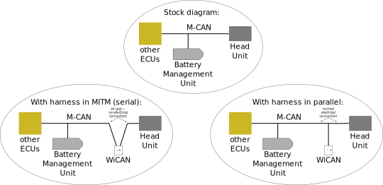

> Car, give me the grace to accept with serenity the things that cannot be changed, courage to build the buttons that Hyundai will never offer as an update, and the wisdom to distunguish the one from the other. 

# Purpose 
We preparing to sell a fully open-source design for an Ioniq 5 preconditioning button that can be implemented with a hardware retrofit kit. This repository serves to document progresss on Ioniq 5 CAN reverse-engineering and status updates on the hardware and software for the kit.
Major contributors to date:
- [Liz](https://github.com/L1Z3): firmware, CAN reverse-engineering
- [Tyler](https://github.com/tylerharvey): glue guy/productizing
- [Corbin](https://www.theioniqguy.com): testing, strategy, marketing, retail
- [Roy](https://github.com/dragz): CAN reverse-engineering
- [Tichael](https://github.com/Tichael): technical review
- [Kenny](https://www.reddit.com/user/KennyBS167/submitted/): technical review
- [Thomas](https://www.ioniqforum.com/members/thomas212.6422/): CAN reverse-engineering

# Basic Explanation
This kit installs just below the car's head unit, in between the head unit and the rest of the car. That allows our microcontroller to duplicate or override any requests the head unit makes of the rest of the car. That allows us to request that the battery management unit initiates preconditioning in exactly the same way the head unit makes that request when using the built-in navigation.

The included wiring harness has two modes: man-in-the-middle (MITM), which you might also call serial, or parallel. 

In man-in-the-middle mode, the head unit is no longer electrically connected to the CAN bus that allows it to communicate with the rest of the car, and lives on its own little network with our microcontroller. The microcontroller decides what to send to the rest of the car and does so fast enough that everything works normally.  The upside of this is that we get a lot of control over communication. The downside is that if you remove the microcontroller, your head unit can no longer talk to the rest of the car. We are getting a customized WiCAN built which will work in man-in-the-middle mode.

In parallel mode, the harness sits on the CAN bus as if it were just another ECU. The head unit communicates normally with the car regardless of whether the microcontroller is in or out. Any microcontroller can be used here to do whatever you can dream up, but we have less control over communication. Our beta test kits ship with a stock WiCAN and are designed to be operated in parallel mode. Our beta testers will have the option to upgrade to a customized WiCAN for free when those are available, and can just [switch the harness mode over](guides/harnesses/head_unit_MITM/MITM_harness_modes.pdf) to MITM when that arrives. The messages we send to the dash are flickery in this mode, as we have to wrestle the head unit for control, but preconditioning activates successfully. 

# Structure
This kit has a few moving parts:
- CAN messages (talking to the car)
- microcontroller to inject CAN messsages (box that talks to the car)
- firmware for that microcontroller (programming for the box)
- wiring harnesss to adapt microcontroller to car (how to plug the box into the car)
- user interface (the button that triggers preconditioning)

We have prototype versions or better of all of the above on several platforms.

Videos of the button in action:
- [dragz triggering preconditioning from a laptop](https://youtu.be/vaBQV_6DW-M?si=8POdBs7m_WmN-vUu)
- [me triggering preconditioning with star button using Liz's firmware](https://youtu.be/1I849mg2cQ4?si=igR4gxgVAqW1klbn)

# Current Status
We have successfully tested manual preconditioning on 3 different microcontrollers, on 3 Ioniq 5s from 3 different markets, on a US Ioniq 6, and will shortly test on a Canadian EV6. Inventory will be available to ship to beta testers sometime in June. A link to Shopify and Etsy stores will be added here soon for beta test orders. 

We are shipping Liz's [WiCAN firmware](https://github.com/L1Z3/wicant-i-precondition) on stock WiCAN-OBD-C3s for the beta run. 

Roy is gathering known E-GMP CAN bus information in [DBC files](https://github.com/dragz/egmpdbc).

# History
1. CAN messages:
   - The necessary CAN messages to initiate preconditioning on 2021-2024 E-GMP cars were isolated by dragz and I in early March 2026. Roy plans to host a DBC file to collect known CAN frames.
2. microcontroller: 
   - We are using a low-cost prepackaged microcontroller to piggyback on existing work and open-source code
3. firmware:
   - Liz and I (mostly Liz) have [working firmware](https://youtu.be/1I849mg2cQ4?si=igR4gxgVAqW1klbn) for one prototype microcontroller [here](https://github.com/tylerharvey/animatronic_panda)
   - Liz successfully ported the logic to two branches of [WiCAN firmware](https://github.com/L1Z3/wicant-i-precondition)
4. wiring harness: 
   - First inventory has been ordered from one vendor
   - 
   - A sample from a separate vendor is on the way to validate a backup option
5. user interface:
   - Liz designed logic to [activate and deactivate](https://youtu.be/3RfnEo8Xc0o?si=r9ix7-klKYVObkZd) preconditioning on star button press; other user interface options may be available in the future

# Contents
Structure of this repository:
## 1. minimal working CAN messages
Two logs (in SavvyCAN format, with timestamps in microseconds) of CAN messages filtered/edited down from logs recorded using [SavvyCAN](https://github.com/collin80/SavvyCAN) and a [WiCAN Pro](https://github.com/meatpihq/wican-fw) that can be sent back to Ioniq 5s with a battery PTC heater equipped and battery preconditioning mode enabled to [initiate](preconditioning_messages/MWE_preconditioning.csv) or [cancel](preconditioning_messages/MWE_cancel_preconditioning.csv) preconditioning manually. These messages were reverse-engineered by [dragz](https://github.com/dragz) and I. See dragz's [articles](https://github.com/dragz/explorationsincarhacking/tree/main/articles) or our [Ioniqforum notes](https://www.ioniqforum.com/posts/666540/) for more documentation. 
## 2. best real logs and parsing script
I am including two real recorded logs [1](CAN_logs/M-CAN_driving_with_nav_preconditioning_at_end_cleaned.csv) and [2](CAN_logs/M-CAN_start_nav_to_EA_parked_in_D_preconditioning_cleaned.csv) that included activation of preconditioning; two real recorded logs designed as control experments using the built-in navigation but not navigating to a nearby charger [1](CAN_logs/M-CAN_driving_with_nav_to_school_no_preconditioning_including_reroute.csv) and [2](CAN_logs/M-CAN_start_nav_to_school_parked_in_D.csv); and a parsing [script](CAN_parsing/parsing_MWE.ipynb) that I retroactively edited to show the most valuable parsing steps I took to identify the minimal working examples (MWEs)
## 3. harness designs
Samples have been made for this harness design:

I am also including the [source file](wiring_harness/M-CAN_dongle_shunt_caps_007-1.yml) used to render the drawings with [wireviz](https://github.com/wireviz/WireViz/). Wireviz was easy to learn and good for a reasonably straightforward harness, but has some limitations: 
- no built-in way to draw resistors or any other basic circuit component besides wires
- no way to directly connect a wire to a wire besides an invisible splice, which confused some vendors
## 4. guides
Written guides are available for:
- [harness mode switching](guides/harnesses/head_unit_MITM/MITM_harness_modes.pdf)
- [Ioniq 5 install](guides/cars/E-GMP_gen1/Ioniq5/head_unit_preconditioning_kit_install.pdf)

# CAN Reverse Engineering Tips/Resources
One or two good logs is far more valuable than 10 questionable logs. I had much better success after identifying my best logs and cleaning them (e.g. out-of-range timestamps from extra acquisitions). Think of log acqusition as a scientific experiment: you want a test and a control condition. In the case of preconditioning, that meant setting the nav to a charger nearby vs. to a school nearby. You can also tag logs with known messages. I plan to use the star buttons for this purpose.

Resources:
- [canbus tools](https://github.com/ajouatom/canbus-tools): a better/longer list of resources
- [OVMS DBC file documentation](https://docs.openvehicles.com/en/latest/components/vehicle_dbc/docs/dbc-primer.html): basic explanation of the structure of a DBC file
- [standalone Cabana](https://github.com/deanlee/openpilot-cabana): fork of openpilot Cabana for general-purpose CAN reverse-engineering
- [kvaser.com](https://kvaser.com/): login needed but various CAN resources available free

# Contributing
Feel free to join the conversation on Ioniqforum or the [E-GMP discord](https://discord.gg/HmwyXv73Br). PRs are welcome for install guide changes, harness requests, or CAN parsing tools.
